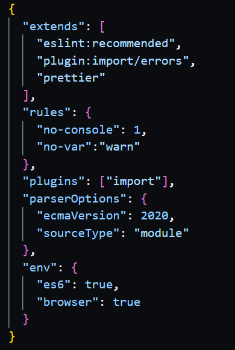

# Assignment 01 - Milestone 02

**Due January 26 (W) @ 9 PM**

**Worth 2% of your final grade**

**Content in this milestone document takes precedence over anything you read in the [assignment pdf](comp-3512-asg-1-winter-2020-current.pdf) and previous milestones.**

## Don't Get Burned (Again)

As was apparent from milestone 1, marking for these milestones is different from what you're used to.

I suggest looking at the marking scheme as a ladder: each grade level is a rung on the ladder. You don't get to the next level unless **ALL** requirements between your current level and the next are complete. So start with the "bottom" requirements and do them, one-by-one, **checking your work carefully as you proceed**, before going to the "upper" ones. Avoid skipping requirements - but if you need to do that for some reason, for heaven's sake remember to go back as soon as you can and complete them.

## Overview

This second milestone is meant to push you into a (possibly temporary!) visual design for the important Default View, as well as get you to wrassle with some movie objects.

Some of the work you do here will be temporary - it will likely need to either modified, moved, or even possibly deleted in future milestones. This is normal in software development. *Don't get too attached to your code, because it will always be a thing in flux.*

**This will be your last individual milestone for this assignment; remaining milestones will be done in teams.**

## The Starting Repository

You will continue to work from the repo you used for milestone 1.

## Your Mark

As with the first milestone, your mark will depend on which requirements sections (see below) you complete.

_I won't repeat any of the commentary from last milestone in this section - it's the same and won't change for the other milestones. What **will** be different will be the grade levels involved, so that gets to stay._

|   Completed Req's Sections   | Grade Level | Corresponding % |
| :--------------------------: | :---------- | :-------------: |
| missing **ANY** of RS0 - RS2 | Level 0     |       0%        |
|          RS0 - RS2           | Level 1     |       25%       |
|          RS0 - RS4           | Level 2     |       55%       |
|          RS0 - RS5           | Level 3     |       65%       |
|       RS0 - RS6 (Fair)       | Level 4     |       75%       |
|       RS0 - RS6 (Good)       | Level 5     |       88%       |
|    RS0 - RS6 (Excellent)     | Level 6     |       98%       |

## The Requirements Sections

### RS0. Prior Requirements Still in Effect

- [ ] [1] The code for your site is located in the GitHub repo created by accepting the GitHub Classroom assignment.
- [ ] [2] The `README.md` file in the repo contains your name and a **working** hyperlink to the Netlify URL of the page (`default.html`) you wish me to mark. (Meaning I should be able to click on the link and go to your page!)
- [ ] [3] The Feedback pull request in the repo has not been closed or merged. 
- [ ] [4] The site is hosted on Netlify and is called `comp-3512-w2022-a1-<mru username>`.
- [ ] [5] All CSS on the site that is "yours" is declared valid by the [W3C CSS Validation Service](https://jigsaw.w3.org/css-validator/).
- [ ] [6] All HTML on the site is declared valid by the [W3C Markup Validation Service](https://validator.w3.org/).

#### Notes

- _I forgot to mention this in milestone 1, so no time like the present: it may seem a bit petty to ask you to validate the CSS and HTML...but trust me when I say that I have helped a LOT of students in Web 1 and 2 "debug" a problem on a web page that was caused by invalid HTML (common) or CSS (not so common). Keep your work clean, even if it's "just" markup/css. Act like a craftsman._

---

### RS1. New GitHub Repo Requirements

- [ ] [7] The GitHub repo contains a modified version of the `.eslintrc.json` file that has added the `"no-var":"warn"` property to the `rules` property present:

     

- [ ] [8] The GitHub repo contains the `movie-data.json` file from the assignment 1 instructions repo.

- [ ] [9] The GitHub repo contains the `movieHelpers.js` file from the assignment 1 instructions repo.

#### Notes

- _The `.eslintrc.json` mod is there to make sure you avoid using `var`. You should reload your VS Code window after making the change._
- _In the future, you'll be getting the movie data online through something called an API - that API will deliver sweet, sweet JSON to you over the network. For now, we'll just plonk that JSON into a file and we can use it through `JSON.parse`._
- _The `movieHelpers.js` file is discussed in the [New JavaScript Requirements](#rs5-new-javascript-requirements) section._

---

### RS2. Default View Requirements: Plumbing

- [ ] [10] The Default View page is a resource named `default.html` that connects to the external JavaScript file `movieHelpers.js`.

When the Default View page is visited, the **Default View** is visible. See items 7-10 on pages 3 & 4 of the [assignment pdf](comp-3512-asg-1-winter-2020-current.pdf) to get a feel for where you're _eventually_ heading.   

For this milestone, we aren't ready yet to build a lot of the functionality - but we can definitely take some steps in the right direction.  

Here are the remaining requirements for this page in this milestone:

---

### RS3. Default View Requirements: Filters

- [ ] [11] There is a header with the text `COMP 3512 Assignment 1`.
- [ ] [12] There is an obvious way to filter movies by title.
- [ ] [13] There is an obvious way to filter movies **before** a given year, **after** a given year, and **between** two years.
- [ ] [14] There is an obvious way to filter movies **below** a given rating, **above** a given rating, and **between** two ratings.
- [ ] [15] There is an obvious way to clear all filters.
- [ ] [16] There is an obvious way to toggle the visibility of the filters.

#### Notes

- **The filtering, clearing, and filter-toggling functionality will not be working in this milestone.**
-  _The before/below and after/above filters should be **exclusive** - meaning they don't include the number provided. For example, movies "before 2010" means movies up to **but not including** 2010._
- _On the other hand, the between filters should be **inclusive** - meaning they include the numbers on both ends. For example, movies with ratings "between 7 and 9" means movies with ratings that include both 7 and 9 - and everything in-between._

---

### RS4. Default View Requirements: Movie Display

- [ ] [17] Three different movies of your choosing are being displayed on this page.
- [ ] [18] Each movie shown displays a poster, title, year, rating, and an obvious way to view details about that movie.
- [ ] [19] There is an obvious way to sort the results by title, year, and rating.

#### Notes

- **The sorting functionality and details viewing will not be working in this milestone.**
- _To populate the content for the 3 movies you choose, you'll have to dig through the `movie-data.json` file and do some copy and pasting. Obviously we won't be doing that in the future, but it's fine for this milestone._

---

### RS5. New JavaScript Requirements

There are a number of TODO items in `movieHelpers.js` Each TODO corresponds to a requirement, which I'll repeat here as well.

- [ ] [20] An array of movie objects, created from `movie-data.json` using the technique illustrated in chapter 8.7.4 of the text (and practiced in lab exercise 8.14), is present in `movieHelpers.js`.
- [ ] [21] A constructor function called `MovieCollection` that implements the behaviour shown in TODO 2 is present in `movieHelpers.js`.
- [ ] [22] A MovieCollection object created using the constructor function is present in `movieHelpers.js`.
- [ ] [23] The console displays an array consisting of all movies, sorted in alphabetic order.
- [ ] [24] The console displays an array consisting of all movies released between 1970 and 1980, sorted in alphabetic order.

---

### RS6. Visual Design Requirements

- [ ] [25] The `default.html` page has a reasonable layout with no glaring issues at Laptop L size.
- [ ] [26] The `default.html` page has a reasonable layout with no glaring issues at Mobile L size.
- [ ] [27] The visual design is portfolio-level quality. I'll be looking for generous use of whitespace, alignment of items, contrast of text in size and weight, good use of color (including accents), non-distorted images, etc.

#### Notes

- _I'll evaluate [27] as being one of Fair, Good, or Excellent. This will be purely a subjective thing, I'm afraid. If the level of [27] is not considered at least Fair, that requirement will be considered unmet._