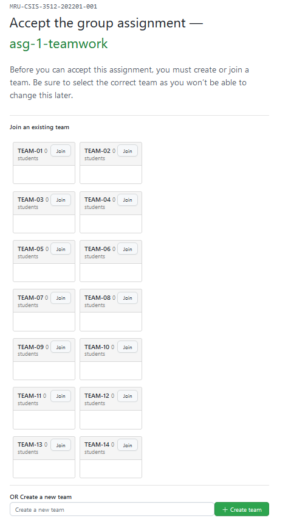

# Assignment 01 - Milestone 03 (WIP - Not Officially Released Yet - 2022-01-25)

**Due February 02 (W) @ 9 PM**

**Worth 2% of your final grade**

**Content in this milestone document takes precedence over anything you read in the [assignment pdf](comp-3512-asg-1-winter-2020-current.pdf) and previous milestones.**

## Overview

This third milestone will involve getting your Movie Details View up. You will also be working with different sources of movie information, with the goal of extracting the information you need to create an individual Movie object.

This is the first of four milestones where you will be working with your teammate(s) - it's important to start off strong and set a good tone with your partner(s). Further info about the teamwork stuff is in the [teamwork](teamwork.md) doc.

## Viewing the Data

You'll need to dig through some fairly large JSON files (especially `credits.json` - that thing is a **beast!**) to do some of the tasks in this milestone.

In their current state, it's super-hard to figure out what's going on in those files. I strongly recommend viewing them in an online JSON viewing tool to make sense of the seeming chaos. I've tried http://jsonviewer.stack.hu/ and https://jsonformatter.org/json-viewer for this and have been reasonably happy. **Don't try and open up `credits.json` in one of these viewers...there's a reasonable chance it'll cause your browser to burst into flame - use the `credits-brief.json` instead - it's there to give you an easy way to view the structure of the full-sized `credits.json`.**

## The Starting Repository

You will be working in a new repository, one that is set up for teams. Each member of the team has admin access to that repo. This will be both useful...and dangerous. Try not to nuke your (and your teammates') stuff.

The starting repo is here: https://classroom.github.com/a/Yd1563o5

When you accept this repo, you'll be asked to select a team:

**Join the team you were told you are on - it's shown in the [teamwork.md](teamwork.md) document. Please do NOT create a new team.**

## Your Mark

As with the first milestone, your mark will depend on which requirements sections (see below) you complete.

### The Ladder
| Completed Req's Sections          | Grade Level | Corresponding % |
| --------------------------------- | :---------: | :-------------: |
| None                              |   Level 0   |       0%        |
| RS0 + Partial RS1,RS21 |   Level 1   |       25%       |
| RS0 - RS1                         |   Level 2   |       55%       |
| RS0 - RS2                         |   Level 3   |       65%       |
| RS0 - RS2 + RS3 is **Fair**       |   Level 4   |       75%       |
| RS0 - RS2 + RS3 is **Good**       |   Level 5   |       88%       |
| RS0 - RS2 + RS3 is **Excellent**  |   Level 6   |       98%       |

_1 If you get all of R0 done and at least **some** of RS1 **and** RS2 complete, you will get a Level 1 instead of a Level 0. I get to decide what "some" means - but I can tell you it ain't going to be one or two requirements!_

__

## The Requirements Sections

As I adjust to working with requirements marking, I will make changes based on experiences with previous milestones. This is called learning. :)

### RSO. Basic Requirements

_These requirements are all supposed to be very easy to complete - but also fundamental to your success (and to making the marking of your work easier for me). Skipping or being careless with these is a bad idea, because your mark becomes hella-low. None of us wants that._

- [ ] [1] The code for your site is located in the GitHub repo created by accepting the GitHub Classroom assignment.
  
- [ ] [2] The `README.md` file in the repo contains the names of all team members and a **working** hyperlink to the Netlify URL of the page (`details.html`) you wish me to mark. (Meaning I should be able to click on the link and go to THAT page!)

- [ ] [3] The Feedback pull request in the repo has not been closed or merged. 

- [ ] [4] The site is hosted on Netlify and is called `comp-3512-w2022-a1-<team>`. For example, `comp-3512-w2022-a1-team04`.

- [ ] [7] You do NOT have the `movie-data.json` file from milestone 2 in your repo.

- [ ] [8] You DO have a `movieHelpers.js` file in your repo.

#### Notes

- _4 You can choose one team member's Netlify account to be the source of the site, or even create a shared Netlify account for that purpose. Whatever works - I just want a working site to look at!_
- _4 Notice that the site name has changed!_
- _7 This will break your JS code from milestone 2 - but that code will be nuked anyway. I warned you that this kind of thing was gonna happen!_
- _8 This file will have completely different contents from last time - see the [JavaScript requirements](#rs2-javascript-requirements) - not the contents from milestone 2._

---

### RS1. Movie Details View Requirements

_See items 11-13 on pages 6 & 7 of the [assignment pdf](comp-3512-asg-1-winter-2020-current.pdf) to get a feel for where you're eventually heading._

_As with milestone 2, the focus here is not yet on the functionality of the site, but on laying the groundwork for that functionality._

_DON'T let the illustration in the pdf limit your creative process - your page does NOT have to look like it. As long as the information that must be available IS available, you're meeting the requirements!_

- [ ] [10] The Movie Details View page is a resource named `details.html` that connects to the external JavaScript file `movieHelpers.js`.

- [ ] [11] There is a header with the text `COMP 3512 Assignment 1`.

- [ ] [ ] The movie displayed on this page is taken from one of the movies in the data provided to you.

- [ ] [ ] The movie title is clearly visible.

- [ ] [ ] The poster for the movie is clearly visible and is shown at w185 size at mobile L and w342 size at laptop L.

- [ ] [ ] The cast of the movie is clearly visible when this page first loads.

- [ ] [ ] Each cast member has their name and character name clearly visible.

- [ ] [ ] The cast of the movie is ordered by the `order` field, ascending.

- [ ] [ ] There is an obvious way to view the crew of the movie.

- [ ] [ ] Each crew member has their name, department, and  clearly visible.

- [ ] [ ] The crew of the movie is ordered alphabetically, first by department, then by name.

- [ ] [ ] There is an obvious way to close this Details view and return to the Default View.

- [ ] [ ] There is an obvious way to have the browser speak the movie title.

- [ ] [ ] **All** of the following are either clearly visible or clearly accessible from this page:

    - [ ] release date
    - [ ] revenue, _**formatted appropriately**_ <- emphasized for a reason, folks
    - [ ] runtime, _**formatted appropriately**_ <- ditto
    - [ ] tagline
    - [ ] IMDB link
    - [ ] TMDB link
    - [ ] overview
    - [ ] ratings (includes **all** of popularity, average, and count)
    - [ ] companies
    - [ ] countries
    - [ ] keywords
    - [ ] genres

- [ ] [ ] All CSS used in `details.html` that is "yours" is declared valid by the [W3C CSS Validation Service](https://jigsaw.w3.org/css-validator/).

- [ ] [ ] All HTML in `details.html` is declared valid by the [W3C Markup Validation Service](https://validator.w3.org/).

#### Notes

- _This will force you to dig around in the JSON and get used to spelunking through data. This is a useful experience!_
- _The entire cast does not have to be visible all at once. This goes for the crew._

---

### RS2. JavaScript Requirements

There are a number of TODO items in `movieHelpers.js` Each TODO corresponds to a requirement, which I'll repeat here as well.

- [ ] An array of movie details, created from `movie-details.json` is present.

- [ ] An array of credits, created from `credits.json` is present.

- [ ] An array of keywords, created from `keywords.json` is present.

- [ ] A variable holding the details of the movie you choose to display is present.

- [ ] A variable holding the credits of the movie you choose to display is present.

- [ ] A variable holding the keywords of the movie you choose to display is present.

- [ ] A constructor function called `Movie` is present that has the behaviour described in the associated TODO.

#### Notes

- _Fair warning: the code you write here will also need to change going forward. Don't get too emotionally attached to it. If it helps, remember that when you're coding, you're not just producing code - you're also building experience, which is infinitely more valuable._

---

### RS3. Visual Design Requirements

The visual design of the `details.html` page will be evaluated at **both** Mobile L and Laptop L size in a Chrome browser. 

#### Unacceptable Visual Design

- [ ] [ ] The overall impression of the page is "what the...???". Issues are numerous and glaring. You wouldn't show this to a potential employer or client.

#### Fair Visual Design

- [ ] [ ] The overall impression of the page is "OK" - it's basically a reproduction of the illustrations shown in the pdf and gives the impression that the visual design was not given much attention. It's not hard to find issues with the design, but they're not show-stoppers. You'd be a bit hesitant showing this to a potential employer or client.

#### Good Visual Design

- [ ] [ ] The overall impression of the page is "hey, that's good!" - it deviates occasionally and reasonably from the illustrations shown in the pdf and gives the impression that the visual design was given some thought and attention. While there are a few areas that obviously need a bit of attention, you'd probably be pretty confident showing this to a potential employer or client.

#### Excellent Visual Design

- [ ] [ ] The overall impression of the page is "wow" - it deviates frequently and thoughtfully from the illustrations shown in the pdf and gives the impression that the visual design was a focus of attention. It's difficult if not impossible to find issue with the page and any such issues are quibbles. You would show this to a potential employer or client with no hesitation whatsoever.

