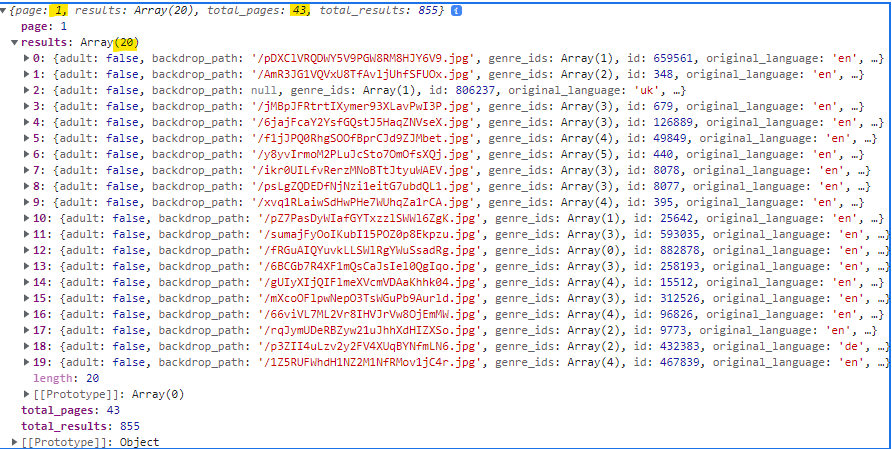

# Assignment 01 - Milestone 06  (WIP)

**Due March 02 (W) @ 9 PM**

**Worth 9% of your final grade**

## API Hints

_I'm assuming you've read the [Using the TMDB API](tmdb-api.md) doc before reading this._

Title searches on the Home View will be querying one of the TMDB API endpoints, returning a number of titles that partially match the search term, along with some further information about each match. You need to find out which endpoint to talk to and examine the data that comes back from that endpoint. You'll find the data contains some very useful information needed later on.

The results you get back are just for 1 "page" of 20 results and while a search might return many pages, you are only expected to use the first page.

_Here's an example of when I searched using the string "alie"; as you can see there are a total of 43(!!!) pages of results and I'm just looking at the first page, which has an array of 20 objects in it._

For each of the matching movie results, you'll need to construct the associated Movie - your Movie constructor function will come in handy here and may need some modification. To get the different parts that make up a movie - details, credits, and keywords - you'll need to make additional API calls. (_Hint: using `Promise.all()` makes quite a bit of sense for this part, since you need to do 3 API calls to make a single Movie...._)

Once you've created these Movie objects, you'll want to store them in session storage, so that they're available for all the displaying and filtering that happens in the other Views. You can either store each individual movie as a key/value pair, or store a single array that contains all the movies - your call. If you decide to store each movie individually, choose your key wisely!

## Your Mark

In this final milestone, you will be assessed on 3 broad categories: Functionality, Visual Design, and Coding Craftsmanship. Each category has its own ladder, as shown below.

Each category has a weighting: Functionality is 50%, Visual Design is 30%, and Coding Craftsmanship is 20%. Your final mark will be the sum of each individual category grade times its weight.

### The Ladders of Marks

#### Functionality Ladder (40%)

| What You've Done | Grade Level | Corresponding % |
|------------------|:-----------:|:---------------:|
| RS0 incomplete   |   Level 0   |       0%        |
| Unacceptable     |   Level 2   |       55%       |
| Fair             |   Level 3   |       65%       |
| Good             |   Level 4   |       75%       |
| Excellent        |   Level 5   |       88%       |
| Excellent+       |   Level 6   |       98%       |

---

#### Visual Design Ladder (30%)

| What You've Done | Grade Level | Corresponding % |
|------------------|:-----------:|:---------------:|
| Unacceptable     |   Level 2   |       55%       |
| Fair             |   Level 3   |       65%       |
| Good             |   Level 4   |       75%       |
| Excellent        |   Level 5   |       88%       |
| Excellent+       |   Level 6   |       98%       |

---

#### Coding Craftsmanship Ladder (20%)

| What You've Done | Grade Level | Corresponding % |
|------------------|:-----------:|:---------------:|
| Unacceptable     |   Level 2   |       55%       |
| Fair             |   Level 3   |       65%       |
| Good             |   Level 4   |       75%       |
| Excellent        |   Level 5   |       88%       |
| Excellent+       |   Level 6   |       98%       |

---

## The Requirements Sections

### RSO. Basic Requirements

**There are new entries in here. Don't skim these.**  

If your team misses any of these, I'll let you fix up to 3 of them. If you miss more than that, I'm sorry - you're just being sloppy and your mark will make y'all extremely unhappy.

- [ ] [1] The Feedback pull request in the repo has not been closed or merged. 

- [ ] [2] All JavaScript used is present in external files. **This means NO embedded or inline JS is present.**

- [ ] [3] The **only** html present in your repository is `index.html`.

- [ ] [4] The `innerHTML` property is not used in any of your JS files.

- [ ] [5] All HTML in `index.html` is declared valid by the [W3C Markup Validation Service](https://validator.w3.org/).
  
- [ ] [6] No alerts are used. 

- [ ] [7] The `async` and `await` keywords are not used anywhere in your JS files.

- [ ] [8] A `populateFavourites()` method is available from the console. See the description for further details.

- [ ] [9] Titles are not used as keys in local/session storage.

_6Because they're amazingly annoying._  
_7Because you need to show competence with basics of asynchronous coding._  
_9See https://www.digitalspy.com/movies/a850564/movies-with-same-name/_

#### The `populateFavourites` Function

In order to test your (un)favouriting functionality, I need a way to quickly populate favourites. You need to create a function that populates local storage with the movies I want.

Here are the requirements for this function:

- [ ] It must be called `populateFavourites`.
- [ ] It doesn't take any parameters.
- [ ] It must be callable from the console.
- [ ] It must have this behaviour:
  - [ ] It clears local storage.
  - [ ] It populates local storage with the 10 movies I had given you for `displayDefault` in milestone 4.

That's it. It's not a lot of code.

### Functionality

Functionality will be assessed on how well the event requirements are met.  

In order to achieve the top level of functionality assessment, you not only need to fulfill all the requirements, but also show an attention to detail that demonstrates you have thought about how the site will be experienced by a user.

#### Unacceptable Functionality

If any of the following are true, the application will be considered to have **unacceptable functionality**:

- [ ] the application still uses the JSON data files as its source of movie data
- [ ] one or more aspects of fundamental functionality (searching, filtering, favouriting, information display) is missing
- [ ] three or more aspects of fundamental functionality (searching, filtering, favouriting, information display) are only partially working

#### Fair Functionality

- [ ] one or two aspects of fundamental functionality (searching, filtering, favouriting, information display) are only partially working
  
#### Good Functionality

- [ ] all aspects of fundamental functionality (searching, filtering, favouriting, information display) are fully working, but there are one or more minor issues that would be noticeable to a user of the site

#### Excellent Functionality

- [ ] all aspects of fundamental functionality (searching, filtering, favouriting, information display) are fully working
- [ ] there are numerous examples of attention to detail (for example, allowing the Enter key to initiate a search, clearing a filter entry when a related filter entry is entered, etc.)

#### Excellent+ 

See the last page of the [final version of the pdf](comp-3512-asg-1-winter-2020-v3.pdf) for details.

---

### Visual Design Craftsmanship

The visual design of all Views will be evaluated at **both** Mobile L and Laptop L size in a Chrome browser. 

It's important that your site has a unified visual "feel". Using the Home View from one team member's milestone 1 submission and the Default View from another team member's milestone 2 submission **definitely** will violate this requirement.

#### Unacceptable Visual Design

- [ ] The overall impression of the Views is "oh dear...". The various Views don't share a visual theme and/or issues are numerous and glaring. You wouldn't show this to a potential employer or client. 

#### Fair Visual Design

- [ ] The overall impression of the Views is "OK" - they're basically reproductions of the illustrations shown in the pdf and give the impression that the visual design was not given much attention. It's not hard to find issues with the design, but they're not show-stoppers. You'd be a bit hesitant showing this to a potential employer or client.

#### Good Visual Design

- [ ] The overall impression of the Views is "hey, that's good!" - they deviate occasionally and reasonably from the illustrations shown in the pdf and give the impression that the visual design was given some thought and attention. While there are a few areas that obviously need a bit of work, you'd probably be pretty confident showing this to a potential employer or client.

#### Excellent Visual Design

- [ ] The overall impression of the Views is "wow" - they deviate frequently and thoughtfully from the illustrations shown in the pdf and give the impression that the visual design was a focus of attention. It's difficult, if not impossible, to find issue with the Views and any such issues are likely quibbles. You would show this to a potential employer or client with no hesitation whatsoever.

#### Excellent+ 

See the last page of the [final version of the pdf](comp-3512-asg-1-winter-2020-v3.pdf) for details.

---

### Coding Craftsmanship

- Do you use appropriate array methods, or recreate the wheel?
- Are unneeded files removed from your repository? (For example, if you use the API for your source of data, have your removed the JSON data files used from the earlier milestones?)
- [ ] [8] No errors are present in the console. This means the favicon one as well.
- [ ] eslint
- [ ] code complexity (tool)
- [ ] globals
- [ ] fors
- [ ] no errors in console.log
- [ ] are functions plentiful, expressively named, and short? (remember, I'm a big fan of naming value-returning functions and non-returning functions in very specific ways)
- [ ] are tricky things documented?
- [ ] are things not yours documented?
- [ ] do you just copy-pasta things in off the web, or do you take the time to name them well, remove outdated techniques, and follow other good practices?

#### Unacceptable Craftsmanship

#### Acceptable Craftsmanship

#### Excellent Craftsmanship

#### Excellent+ 

See the last page of the [final version of the pdf](comp-3512-asg-1-winter-2020-v3.pdf) for details.

