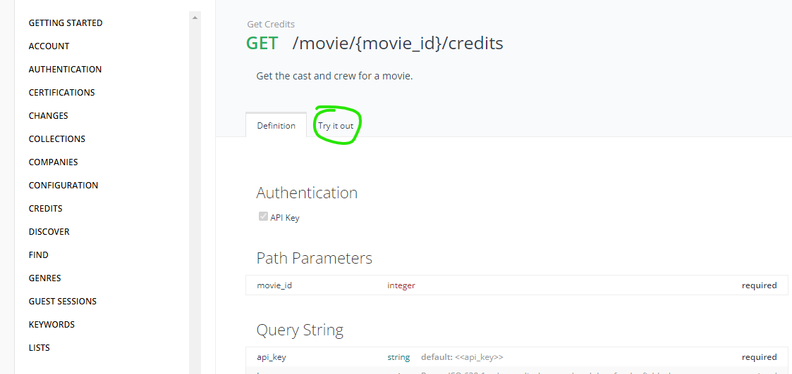
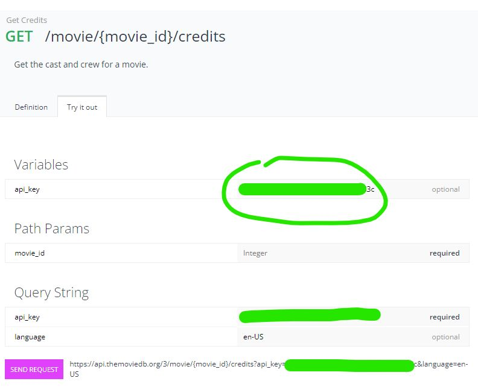
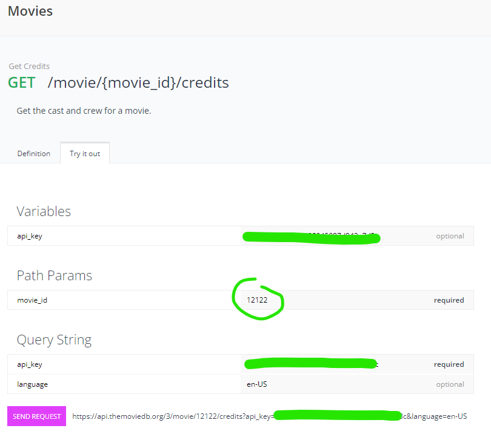
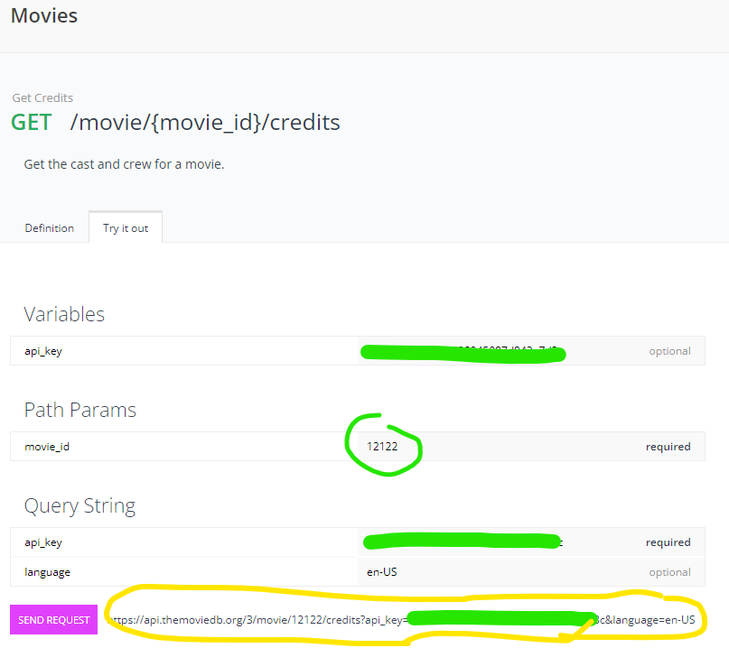
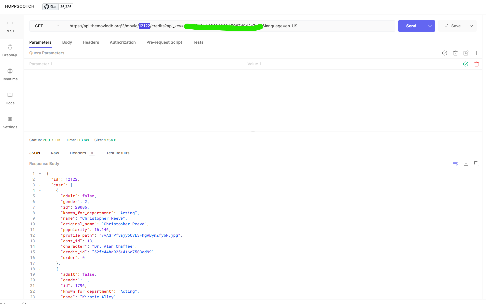

# Using the TMDB API

As I've mentioned in lecture a few times, the days of working with data in JSON files is coming to an end. Time to talk to some APIs!

TMDB allows people with an **API key** to use the various endpoints to get data about movies. So I guess you'll need a key!

**please use version 3 of the API**

## getting a key

Head on over to https://developers.themoviedb.org/3/getting-started and follow the instructions there.

You'll need to create a TMDB account to complete this step.

You'll be happy to know that all this stuff is free. That's nice.

## once you've got a key

Once you have an API key, make sure you keep it someplace easily accessible - you're going to use it a lot. (You can always access it through your account info on TMDB, but it's way more useful to have it somewhere else.)

The first thing you should do with your key...is play around with it. Do NOT just jump in and try to figure out how to do the assignment. Go exploring.

### hoppscotch: a wonderful tool

To play around effectively, I'd suggest going to https://hoppscotch.io/. It's a very cool web app that lets you query APIs (among other things) in a very intuitive way.

### an example of exploring

One of the things you do in the assignment is get credits info for movies, right? Let's try seeing what that feels like.

1. Go to https://developers.themoviedb.org/3/movies/get-movie-credits. There's a lot of unfamiliar info here, sure - but there's also a very enticing "Try it out" tab, eh?

2. Slap your API key in the api_key location (I'm hiding my key, yo):

 

3. Then put a movie_id in the movie_id field. (Like 12122)

4. Then copy/paste the endpoint URL at the bottom...

5. ...into hoppscotch and hit Send. You got you some JSON response action there!

Look familiar? It should! It's the credits JSON for the movie with the id 12122!

## now what?

You need to:

- figure out where to get keywords information, and
- figure out where to get details information, and
- figure out where to get information for that autocomplete

See what you can come up with.

Then...see if you can write a function that gets the credits (or keywords or details) for a given id. Try that function out in your browser console.

## and then what?

You need to figure out how these API calls are going to replace the JSON files you've used up to now.

And you need to figure out how to do the autocomplete using a certain API call.

## about that autocomplete

The API call you'll wind up doing only returns one "page" of matches at a time. Each "page" gives you 20 (IIRC) matching movies. YOU ONLY NEED TO GRAB THE FIRST PAGE OF RESULTS FOR YOUR AUTOCOMPLETE.

## whose key do you use?

It doesn't matter, just choose someone.

## should I secure my key somehow?

Ideally, yes...but you'd have to do some research to figure out how and it's not an expectation of this assignment. (It's definitely a good idea professionally, so if you're planning on having a nice portfolio piece to show off, you'd likely want to do something eventually to secure your key.)